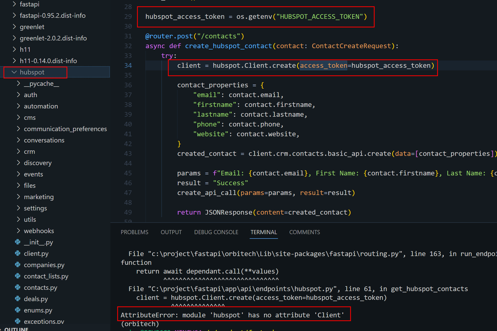

# OrbiTech


El objetivo de este proyecto es crear una API REST en Python utilizando FastAPI, que permita la creación de contactos en HubSpot y su sincronización con ClickUp. Además, registra un registro de cada llamada realizada a la API en una base de datos PostgreSQL alojada en un servidor externo. La API consta de dos endpoints principales, se agregan algunos más...:

- **Endpoint de creación de contacto en HubSpot:** Utilizando la biblioteca de HubSpot, este endpoint permite la creación de contactos en la plataforma de HubSpot. Los contactos deben incluir los siguientes datos (se proporcionan valores de ejemplo, puedes personalizarlos):
```
{
  "email": "test@sample.com",
  "firstname": "Test",
  "lastname": "Lastest",
  "phone": "(322) 123-4567",
  "website": "sample.com"
}
```
- **Endpoint de sincronización de contactos entre HubSpot y ClickUp:** Este endpoint sincroniza los contactos creados en HubSpot con ClickUp, agregándolos como tareas en una lista. Antes de crear un contacto en ClickUp, se verifica si ya existe utilizando la propiedad "estado_clickup" de los contactos de HubSpot. Dado que este proceso puede llevar más de 10 segundos, dependiendo de la cantidad de contactos que se deben sincronizar, se aplican Background Tasks para asegurar que el tiempo de respuesta del endpoint no sea excesivamente largo.

Cada llamada realizada a la API se registra en una base de datos PostgreSQL en caso de que ocurra algún error. Los registros incluyen la fecha y hora de la llamada a la API, los datos de entrada (parámetros GET o POST) y el resultado de la operación.

## Estructura del Proyecto

La estructura del proyecto se organiza de la siguiente manera:

```
├── app
│ ├── api
│ │ ├── endpoints
│ │ │ ├── init.py
│ │ │ ├── hubspot.py
│ │ │ └── clickup.py
│ ├── database
│ │ ├── init.py
│ │ ├── connection.py
│ │ ├── crud.py
│ │ └── models.py
│ └── main.py
├── .env
├── .gitignore
├── README.md
└── requirements.txt
```

- **app/api/endpoints**: Contiene los archivos de los endpoints de la API.
  - **__init__.py**: Inicializa los routers de los endpoints y los agrega al enrutador principal.
  - **hubspot.py**: Define los endpoints relacionados con HubSpot.
  - **clickup.py**: Define los endpoints relacionados con ClickUp.
- **app/database**: Contiene los archivos relacionados con la base de datos.
  - **__init__.py**: Inicializa la conexión a la base de datos y proporciona funciones CRUD.
  - **connection.py**: Configura la conexión a la base de datos utilizando SQLAlchemy.
  - **crud.py**: Define las funciones CRUD para crear, consultar y verificar contactos.
  - **models.py**: Define los modelos de datos de la base de datos utilizando SQLAlchemy.
- **app/main.py**: Archivo principal del proyecto que contiene la lógica de la aplicación.
- **.env**: Archivo de configuración que almacena las variables de entorno para la conexión a la base de datos.
- **.gitignore**: Archivo que especifica los archivos y directorios que se deben ignorar en el repositorio Git.
- **README.md**: Este archivo que proporciona documentación y descripción del proyecto.
- **requirements.txt**: Archivo que lista las dependencias del proyecto.

## Instalación

1. Clona este repositorio en tu máquina local.
2. Instala las dependencias utilizando el siguiente comando:

```
pip install -r requirements.txt
```

## Configuración

1. Crea un archivo `.env` en la raíz del proyecto y define las siguientes variables de entorno:
```
DB_HOST=<dirección del host de la base de datos>
DB_PORT=<puerto de la base de datos>
DB_USER=<usuario de la base de datos>
DB_PASS=<contraseña de la base de datos>
DB_NAME=<nombre de la base de datos>
```


## Uso

1. Ejecuta el archivo `main.py` para iniciar la aplicación.

```
python main.py
```

2. Accede a la aplicación desde tu navegador web en `http://localhost:8000`.


## Endpoints

El proyecto incluye los siguientes endpoints de la API:

- `/hubspot/contacts` (GET): Lista las propiedades en HubSpot.
- `/hubspot/contacts` (POST): Crea un nuevo contacto en HubSpot.
- `/clickup/sync` (POST): Sincroniza los contactos

## Errors

Impedimento al tratar de integrar el api: https://developers.hubspot.com/docs/api/crm/contacts




## Créditos

Autor: Alexander Mina

